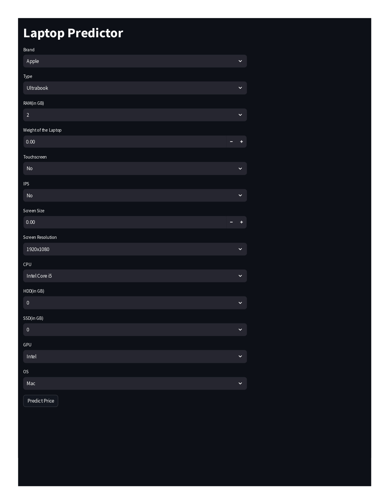

# Laptop Price Prediction System

This repository contains a **Laptop Price Prediction System** developed using Python and machine learning algorithms to estimate laptop prices based on key specifications. The system preprocesses data, trains a predictive model, and provides price predictions, offering valuable insights for users, retailers, and manufacturers.

## Table of Contents

- [Project Overview](#project-overview)
- [System Workflow](#system-workflow)
- [Model Architecture](#model-architecture)
- [Project Prerequisites](#project-prerequisites)
- [Installation](#installation)
- [Usage](#usage)
- [Technologies Used](#technologies-used)
- [Future Enhancements](#future-enhancements)
- [Contributors](#contributors)

## Project Overview

The **Laptop Price Prediction System** leverages machine learning to predict laptop prices based on specifications such as brand, processor, RAM, storage, screen size, and more. This project is ideal for market analysis, helping users and businesses estimate prices accurately to make informed decisions.




## System Workflow

System Workflow
The system follows these steps to predict laptop prices:

1. **Data Collection**: A dataset of laptop specifications and their prices is gathered.
2. **Data Preprocessing**: Data is cleaned, encoded, and normalized for optimal model performance.
3. **Feature Selection**: Key features that impact laptop prices are selected.
4. **Model Training**: A machine learning model is trained on the preprocessed data.
5. **Price Prediction**: The model predicts prices based on the input specifications.

## Model Architecture
Several machine learning models were explored and evaluated for the Laptop Price Prediction System to determine the most accurate and reliable predictor for laptop prices. The following models were tested:

- **Linear Regression**
- **Lasso Regression**
- **Ridge Regression**
- **Support Vector Machine (SVM)**
- **Decision Tree**
- **Random Forest**

Evaluation Metrics
Each model was evaluated using the R² Score and Mean Absolute Error (MAE):

**R² Score**: Measures how well the model explains the variance in the dataset. A higher R² indicates a better fit.
**Mean Absolute Error (MAE)**: Measures the average magnitude of errors between predicted and actual values, with lower values indicating more accurate predictions.

Best Model: **Random Forest**
After testing each model, the Random Forest algorithm provided the best results, outperforming others with the following metrics:

- **R² Score**: 0.8822
- **Mean Absolute Error (MAE)**: 0.1603


## Project Prerequisites

To run this project, you will need Python (3.6 or above) and a few essential libraries:

1. **pandas** - For data manipulation:
   ```bash
   pip install pandas
   ```

2. **scikit-learn** - For machine learning models:
   ```bash
   pip install scikit-learn
   ```

3. **matplotlib and seaborn** - For data visualization:
   ```bash
   pip install matplotlib seaborn
   ```

## Installation

1. **Clone the Repository**:

   ```bash
   git clone https://github.com/yourusername/Laptop-price-Prediction-ML-project.git
   cd Laptop-price-Prediction-ML-project
   ```

2. **Install Dependencies**:

   Install the necessary libraries if not already installed:

   ```bash
   pip install -r requirements.txt
   ```

3. **Run the System**:

   Run the Python script to start the Laptop-price-Prediction:

   ```bash
   python app.py
   ```

## Usage

1. **Load Data**: Input the laptop specifications as prompted.
2. **Price Prediction**: The system processes the data and outputs a price prediction based on the trained model.
3. **Visual Analysis**: Optional visualization modules display insights on the influence of specifications on price.

## Technologies Used

- **Python**: Programming language for model development.
- **pandas & numpy**: Libraries for data preprocessing and manipulation.
- **scikit-learn**: Used to train and evaluate the machine learning models.
- **matplotlib & seaborn**: For data visualization and exploratory data analysis (EDA).


## Future Enhancements

- **Improved Alert System**: Implement an audio alarm or haptic feedback for real-world scenarios.
- **Multimodal Detection**: Combine eye tracking with other indicators like head position or yawning detection.
- **Real-Time Optimization**: Optimize model performance for real-time applications on low-power devices.

## Contributors

- **Krishnandan sah**
